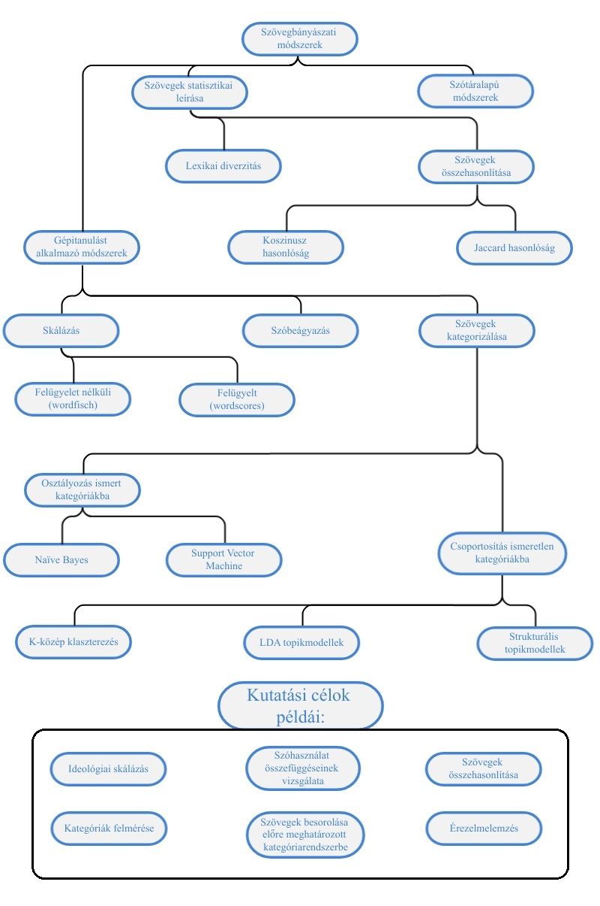

# Bevezetés {#intro}

```{r include=FALSE}

source("_common.R")

```

## A kötet témái

A szövegek adatként való értelmezése (*text as data*) és kvantitatív elemzése (*quantitative text analysis*), avagy a szövegbányászat (*text mining*) a nemzetközi társadalomtudományi kutatások egyik leggyorsabban fejlődő irányzata. A szövegbányászat egy olyan folyamat, amely során nyers, strukturálatlan szövegeket (pl.: beszédek, felszólalások, újságcikkek) egy strukturált formátumba helyezünk, hogy így új, korábban ismeretlen információkhoz tudjunk hozzájutni, mint trendekhez, mintázatokhoz, összefüggésekhez stb. A szövegek és más kvalitatív adatok (filmek, képek) elemzése annyiban különbözik a mennyiségi (kvantitatív) adatokétól, hogy nyers formájukban még nem alkalmasak statisztikai, illetve ökonometriai elemzésre. Ezért van szükség az ezzel összefüggő módszertani problémák speciális tárgyalására.

Jelen kötet bevezeti az érdeklődőket a szövegbányászat és a mesterséges intelligencia társadalomtudományi alkalmazásának ilyen speciális problémáiba, valamint ezek gyakorlati megoldásába. Közvetlen előzménynek tekinthető a témában a Sebők Miklós által szerkesztett [*Kvantitatív szövegelemzés és szövegbányászat a politikatudományban*](https://poltextlab.tk.hu/uploads/files/Kvantitativ_szovegelemzes_keszpdf.pdf) címmel megjelent könyv, amely a magyar tudományos diskurzusban kevésbé bevett alapfogalmakat és eljárásokat mutatta be [@sebokKvantitativSzovegelemzesEs2016]. A hangsúly az elméleten volt, bár számos fejezet foglalkozott konkrét kódrészletek elemzésével. Míg az előző kötet az egyes kódolási eljárásokat, illetve ezek kutatásmódszertani előnyeit és hátrányait ismertette, ezúttal a társadalomtudományi elemzések során használható kvantitatív szövegelemzés legfontosabb gyakorlati feladatait vesszük sorra, ezek egymással való logikai kapcsolatátt illusztrálja a lenti ábra. A könyvben bemutatott kódok elsősorban a quanteda csomagot illetve egyes a quanteda-ra épülő csomagokat használnak [@benoit2018].



A kötetünkben tárgyalt egyes módszereket három kategóriába sorolhatjuk, a működési elvük alapján. A szövegek statisztikai leírása egyszerre lehet két szöveg összehasonlítása például a Koszinusz vagy Jaccard hasonlóság alapján, melyekről a [Szövegösszehasonlítás](#similarity) fejzetben írunk, valamint egy adott szöveg különböző statisztikai jellemzőinek leírása, az erre voantkozó módszerekkel [Leíró statisztika](#leiro_stat) című fejezet foglalkozik. A szótáralapú módszerekről és ezek érzelemelemzésre való használatát a [Szótárak és érzelemelemzés](#sentiment) című fejezet tárgyalja. Az ideológiai skálázás során politikai szereplők egymáshoz viszonyított realtív pozícióit azonosítjuk általában beszédek, illetve felszólalások alapján az erre vonatkozó módszertant a [Szövegskálázás](#scaling) című fejezet részletezi. A szövegbányászat egyik legalapvetőbb problémája a dokumentumok egyes kategóriákba való csoportosítása. Az erre vonatkozó módszerek két alkategóriája közül is többet mutatunk be. Amikor ismert kategóriákba történő osztályzásról beszélünk, akkor a kutatónak kell meghatároznia előre a kategóriákat a modell számára, mielőtt az replikálja a besorolásokat. Mind a Naïve Bayes és a Support Vector Machine ezt a feladatot látja el ezek működéséről és alkalmazásáról az [Osztályozás és felügyelt tanulás](#felugyelt) című fejezetben írunk. Ezzel szemben ismeretlen kategóriákba való csoportosítás esetén a kutató nem ad előzőleges utatsítást az algoritmus számára, a modell a csoportosítást a dokumentumok szövegében meglévő látens mintázatok alapján végzi el. Az ismeretlen kategóriákba történő csoportosítást a könyvben bemutatott több módszerrel is elvégezhetjók, mint a K-közép klaszterezés, Latent Dirichlet Allocation, és Struktúrális topikmodellek, amelyeket a [Felügyelet nélküli tanulás - Topikmodellezés](#lda_ch) című fejezetben tárgyaljuk. A Végezetül pedig a szóbeágyazások ellentétben a korábbiakban említett szózsák logikát követő módszerekkel képesek egy dokumentum szóhasználatának belső összefüggéseit azonosítani, ezzel a kifejezetten rugalmas kutatási módszerrel, illetve alkalmazásával [Szóbeágyazások](#embedding) fejezetben foglalkozunk.

Könyvünk a magyar tankönyvpiacon elsőként ismerteti lépésről-lépésre a nemzetközi társadalomtudományban használatos kvantitatív szövegelemzési eljárásokat. A módszereink bemutatására szolgáló elemzéseket az R programnyelv segítségével végeztük el, mely a nemzetközi társadalomtudományi vizsgálatok során egyik leggyakrabban használt környezet a Python mellett. A kötetben igyekeztünk magyar szakkifejezéseket használni, de mivel a szövegbányászat nyelve az angol, mindig megadtuk, azok angol megfelelőjét is. Kivételt képeznek azok az esetek, ahol nincs használatban megfelelő magyar terminológia, ezeknél megtartottuk az angol kifejezéseket, de magyarázattal láttuk el azokat.

Az olvasó a két kötet együttes használatával olyan ismeretek birtokába jut, melyek révén képes lesz alkalmazni a kvantitatív szövegelemzés és szövegbányászat legalapvetőbb eljárásait saját kutatásaiban. Deduktív vagy induktív felfedező logikája szerint dönthet az adatelemzés módjáról, és a felkínált menüből kiválaszthatja a kutatási tervéhez legjobban illeszkedő megoldásokat. A bemutatott konkrét példák segítségével pedig akár reprodukálhatja is ezen eljárásokat saját kutatásában. Mindezt a kötet fejezeteiben bőséggel tárgyalt *R-scriptek* (kódok) részletes leírása is segíti. Ennek alapján a kötet két fő célcsoportja a társadalomtudományi kutatói és felsőoktatási hallgatói-oktatói közösség. Az oktatási alkalmazást segítheti a fontosabb fogalmak magyar és angol nyelvű tárgymutatója, valamint több helyen a további olvasásra ajánlott szakirodalom felsorolása. A kötet honlapján ([https://tankonyv.poltextlab.com](https://tankonyv.poltextlab.com)) közvetlenül is elérhetőek a felhasznált adatbázisok és kódok.

Kötetünk négy logikai egységből épül fel. Az első négy fejezet bemutatja azokat a fogalmakat és eljárásokat, amelyek elengedhetetlenek egy szövegbányászati kutatás során, valamint itt kerül sor a szöveges adatforrásokkal való munkafolyamat ismertetésére, a szövegelőkészítés és a korpuszépítés technikáinak bemutatására. A második blokkban az egyszerűbb elemzési módszereket tárgyaljuk, így a leíró statisztikák készítését, a szótár alapú elemzést, valamint érzelemelemzést. A kötet harmadik blokkját a mesterséges intelligencia alapú megközelítéseknek szenteljük, melynek során az olvasó a felügyelt és felügyelet nélküli tanulás fogalmával ismerkedhet meg. A felügyelet nélküli módszerek közül a topik-modellezést, szóbeágyazást és a szövegskálázás wordfish módszerét mutatjuk be, a felügyelt elemzések közül pedig az osztályozással foglalkozunk részletesebben. Végezetül kötetünket egy függelék zárja, melyben a kezdő RStudió felhasználóknak adunk gyakorlati iránymutatást a programfelülettel való megismerkedéshez, használatának elsajátításához.

## Használati utasítás

A könyv célja, hogy keresztmetszeti képet adjon a szövegbányászat R programnyelven használatos eszközeiről. A fejezetekben ezért a magyarázó szövegben maga az R kód is megtalálható, illetve láthatóak a lefuttatott kód eredményei. Az alábbi példában a sötét háttér az R környezetet jelöli, ahol az R kód betűtípusa is eltérő a főszövegétől. A kód eredményét pedig a `#>` kezdetű sorokba szedtük, ezzel szimulálva az R console ablakát.

```{r}
# példa R kód
1 + 1
```

Az egyes fejezetekben szereplő kódrészleteket egymás utáni sorrendben bemásolva és lefuttatva a saját R környezetünkben tudjuk reprodukálni a könyvben szereplő technikákat. A [Függelékben](#fuggelek) részletesebben is foglalkozunk az R és az RStudio beállításaival, használatával. Az ajánlott R minimum verzió a 4.0.0, illetve az ajánlott minimum RStudio verzió az 1.4.0000.[^bevezetes-1]

[^bevezetes-1]: Az R Windows, OS X és Linux változatai itt érhetőek el: <https://cloud.r-project.org/>. Az RStudio pedig innen érhető el: <https://www.rstudio.com/products/rstudio/download/>.

A könyvhöz tartozik egy `HunMineR` nevű R csomag is, amely tartalmazza az egyes fejezetekben használt összes adatbázist, így az adatbeviteli problémákat elkerülve lehet gyakorolni a szövegbányászatot. A könyv megjelenésekor a csomag még nem került be a központi R CRAN csomag repozitóriumába, hanem a poltextLAB GitHub repozitóriumából tölthető le.

A könyvben szereplő ábrák nagy része a `ggplot2` csomaggal készült a `theme_set(theme_light())` opció beállításával a háttérben. Ez azt jelenti, hogy az ábrákat előállító kódok a `theme_light()` sort nem tartalmazzák, de a tényleges ábrán már megjelennek a tematikus elemek.

Az egyes fejezetekben használt R csomagok listája és verziószáma a lenti táblázatban található. Fontos tudni, hogy a használt R csomagokat folyamatosan fejlesztik, ezért elképzelhető hogy eltérő verziószámú változatok esetén változhat a kód szintaxis.

```{r echo=FALSE, results='asis'}
library(xtable)

book_packages <- readRDS("data/temp/package_table.RDS")

print(xtable(book_packages, align="llr", caption="A könyvben használt R csomagok", ), include.rownames=FALSE, type = "html")
```

## A HunMineR használata

A Windows rendszert használóknak először az `installr` csomagot kell telepíteni, majd annak segítségével letölteni az Rtools nevű programot (az OS X és Linux rendszerek esetében erre a lépésre nincs szükség). A lenti kód futtatásával ezek a lépések automatikusan megtörténnek.

```{r eval=FALSE}
# az installr csomag letöltése és installálása
install.packages("installr")
# az Rtools.exe fájl letöltése és installálása
installr::install.Rtools()
```

Ezt követően a `devtools` csomagban található `install_github` paranccsal tudjuk telepíteni a `HunMineR` csomagot, a lenti kód lefuttatásával.

```{r eval=FALSE}
# A devtools csomag letöltése és installálása
install.packages("devtools")
# A HunMineR csomag letöltése és installálása
devtools::install_github("poltextlab/HunMineR")
```

Ebben a fázisban a `data` függvénnyel tudjuk megnézni, hogy pontosan milyen adatbázisok szerepelnek a csomagban, illetve ugyanitt megtalálható az egyes adatbázisok részletes leírása. Ha egy adatbázisról szeretnénk többet megtudni, akkor a kiegészítő információkat `?adatbazis_neve` megoldással tudjuk megnézni.[^bevezetes-2]

[^bevezetes-2]: Többek között az adat forrása, a változók részletes leírása, illetve az adatbázis mérete is megtalálható így.

```{r eval=FALSE}
# A HunMineR csomag betöltése
library(HunMineR)
# csomagban lévő adatok listázása
data(package = "HunMineR")
# A miniszterelnöki beszédek minta adatbázisának részletei
?data_miniszterelnokok
```


## Egy bevezető példa {#handson}

A következőkben egy példát mutatunk be a szövegbányászat gyakorlati alkalmazására vonatkozóan, amely során Ady Endre és Petőfi Sándor összes verseinek szóhasználatát hasonlítjuk össze, az eredményekhez pedig szemléletes ábrázolást is készítünk. A jelen példában alkalmazott eljárásokat a későbbi fejezetekben részletesen is kifejtjük itt csupán szemléltetni kívánjuk velük, hogy milyen jellegű elemzéseket sajátíthat majd el az olvasó a könyv segítségével.

 Az R számos kiegészítő csomaggal rendelkezik, amelyek hasznos funkcióit úgy érhetjük el, ha telepítjük az őket tartalmazó csomagot. Ezt az `install.packages` paranccsal tehetjük meg, ha már korábban egyszer elvégeztük, akkor nem szükséges egy csomaggal megismételni. A lenti kódsorral a példánkhoz szükséges csomagokat telepíthetjük, de a könyvben használt többi csomagot is ezzel a módszerrel telepíthetjük.
 
```{r, eval=FALSE}
install.packages("readtext")
install.packages("readr")
install.packages("quanteda")
install.packages("quanteda.textstats")
install.packages("quanteda.textplots")
install.packages("ggplot2")
install.packages("dplyr")
```

A `library()` paranccsal pedig betölteni tudjuk a már telepített csomagjainkat, ezt minden alkalommal el kell, hogy végezzük, hogyha ezek egy funkcióját kívánjuk használni. Itt láthatjuk, hogy a két csomag után a HunMineR betöltése is szükséges, viszont annak ellenére, hogy ugyanazzal a funkcióval hívjuk elő a HunMiner nem egy csomag, hanem egy `repository` (adattár) így a telepítése egy eltérő eljárással zajlik az előző alfejezetben leírtaknak megfelelően.

```{r}
library(readtext)
library(readr)
library(quanteda)
library(quanteda.textstats)
library(quanteda.textplots)
library(ggplot2)
library(dplyr)
library(HunMineR)
```

Ezt követően betöltjük a szükséges adatokat, jelen esetben a HunMiner adattárából.

```{r}
ady <- HunMineR::data_ady

petofi <- HunMineR::data_petofi
```

A betöltött adattáblák megjelennek az Rstudio environemnt fülében, ahol azt is láthatjuk, hogy 619 megfigyelésünk vagyis versünk van a Petőfi táblában, Ady esetében pedig 1309. Ahhoz, hogy adatokat használni tudjunk azokon először mindig úgynevezett tisztítási folyamatokat kell elvégeznünk, valamint át kell alakítanunk az adataink formátumát is. Az úgynevezett szövegtisztítási folyamatok a szövegeink előkészítését jelentik, ha kihagyjuk őket vagy nem végezzük el őket kellő alapossággal, akkor az eredményeink félrevezetőek lesznek. Az R-rel való kódolás során többféle formátumban is  tárolhatjuk az adatainkat, illetve az adataink egyik formátumból másikba való átalakítására is van lehetőségünk. Az egyes formátumok az adatokat különböző elrendezésben tárolják, azért van szükségünk gyakran az adataink átalakítására, mivel az R-n belüli funkciókat, amelyekre szükségünk lesz csak specifikus formátumokon hajthatjuk végre.

Első lépésként korpusz formátumba helyezzük az adatainkat, erre csupán azért van szükség mert a későbbiekben ebből a formátumból tudjuk majd őket, token formátumba helyezni. 

```{r}
ady_corpus <- corpus(ady)

petofi_corpus <- corpus(petofi)
```

Ezt követően betölthetjük a HunMiner csomagból a stop szavainkat, ez egy szó lista, amelyet a szövegelőkészítés során elfogunk távolítani a korpuszból.

```{r}
stopszavak <- HunMineR::data_stopwords_extra
```

A corpus formátumban lévő szövegeket nem csak token formátumba helyezzük a lenti kódsorokkal, hanem több szövegtisztító lépést is elvégzünk velük.  A `remove_punct` funkció segítségével eltávolítjuk a mondatvégi írásjeleket, veszőket. A `tokens_tolower()` parancs segítségével minden szavunk betűjét kisbetűvé alakítjuk így a kódunk nem tesz különbséget ugyanazon szó két alternatív megjelenése között csupán azért, mert az egyik a mondat elején helyezkedik el. Végül pedig a `tokens_remove()` parancs segítségével eltávolíthatjuk a korábban betöltött stopszavakat a szövegeinkből.

```{r}
ady_tok <- tokens(ady_corpus, remove_punct = TRUE) %>% 
  tokens_tolower() %>% 
  tokens_remove(stopszavak)

petofi_tok <- tokens(petofi_corpus, remove_punct = TRUE) %>%
  tokens_tolower() %>% 
  tokens_remove(stopszavak)
```

Ezt követően a token formátumban lévő adatainkat dfm formátumba helyezzük. 

```{r}
ady_dfm <- dfm(ady_tok)

petofi_dfm <- dfm(petofi_tok)
```

Majd megnyírbáljuk a szavaink listáját: a `dfm_trim()` parancs segítségével beállíthatjuk, hogy milyen gyakorisággal megjelenő szavakat hagyjunk az adataink között. Vannak jó okok mind a túlságosan gyakran megjelenő és a túlságosan kevésszer megejelenő szavak eltávolítására is. Ha egy szó nagyon gyakran jelenik meg, akkor feltételezhető, hogy az nem segít a számunkra értelmezni az egyes dokumentumaink közötti különbséget, mivel nem különbözteti meg azokat. Ha pedig egy szó túlságosan kevésszer jelenik meg, akkor az lehet, hogy egy egyedülálló eset, amely nem adhat a dokumentumainkra általánosítható információt a számunkra. Jelen kód előírja, hogy ahhoz, hogy egy szó bekerüljün az összehasonlításunkba legalább 25-ször meg kell jelenie a szövegben.

```{r}
ady_dfm <- dfm_trim(ady_dfm, min_termfreq = 25)

petofi_dfm <- dfm_trim(petofi_dfm, min_termfreq = 25)
```

Végül pedig az R programon belül ábrázolhatjuk is az eredményeinket. Jelen esetben nem végeztünk el számítást, hanem a megtisztított szövegeink szavaiból generáltunk szófelhőket.

A Petőfi versekből készült szófelhő:

```{r, fig.cap="Petőfi szófelhő"}
textplot_wordcloud(petofi_dfm, min_count = 25, color = "red")
```

Az Ady versekből készült szófelhő:

```{r, fig.cap="Ady szófelhő"}
textplot_wordcloud(ady_dfm, min_count = 25, color = "orange")
```

Az így kapott ábrákon az Ady és Petőfi versek szavait láthatjuk egy úgynevezett szófelhőben összegyűjtve. Annál nagyobb méretben jelenít meg az ábránk egy kifejezést, minél gyakrabban fordul az elő a szövegünkben, amely jelen esetben a két költő összes verse. A két szófelhőn látszódik, hogy jelentős az átfedés a felhasznált szavakkal, úgyhogy a folyamatot megismételhetjük, azzal a kiegészítéssel, hogy a szófelhő létrehozása előtt eltávolíjuk mindazokat a szavakat, amelyek jelen vannak a másik korpuszban, így jobban láthatjuk, hogy mely kifejezések különböztetik meg a költőket. Ehhez először kigyűjtjük a `featnames()` funkció segítségével a két dfm egyegedi szavait.

```{r}
ady_szavak <- featnames(ady_dfm)

petofi_szavak <- featnames(petofi_dfm)
```

Ezt követően pedig megismételjük a korábbi előkészítő műveleteket azzal a kiegészítéssel, hogy eltávolítjuk az előbb létrehozott két szólistát is.

```{r}
ady_tok <- tokens(ady_corpus, remove_punct = TRUE) %>% 
  tokens_tolower() %>% 
  tokens_remove(stopszavak) %>% 
  tokens_remove(petofi_szavak)

petofi_tok <- tokens(petofi_corpus, remove_punct = TRUE) %>%
  tokens_tolower() %>% 
  tokens_remove(stopszavak) %>% 
  tokens_remove(ady_szavak)

ady_dfm <- dfm(ady_tok) %>% 
  dfm_trim(min_termfreq = 25)

petofi_dfm <- dfm(petofi_tok) %>% 
  dfm_trim(min_termfreq = 25)
```

Ha ezzel végeztünk, akkor ismét létrehozhatjuk a két szófelhőnket.

```{r, fig.cap="Petőfi szófelhő"}
textplot_wordcloud(petofi_dfm, min_count = 25, color = "red")
```

```{r, fig.cap="Ady szófelhő"}
textplot_wordcloud(ady_dfm, min_count = 25, color = "orange")
```

Ugyan a szófelhő nem egy statisztikai számítás, amely alapján következtetéseket vonhatnánk le a vizsgált szövegekről, de egy hasznos és látványos ábrázolási módszer, illetve jelen esetben jól példázza az R egy jelentős előnyét, hogy a segítségével az eredményeinket gyorsan és egyszerűen tudjuk ábrázolni.

## Köszönetnyilvánítás

Jelen kötet az ELKH Társadalomtudományi Kutatóközpont poltextLAB szövegbányászati kutatócsoportja (<http://poltextlab.com/>) műhelyében készült. A kötet fejezetei Sebők Miklós, Ring Orsolya és Máté Ákos közös munkájának eredményei. Az *Alapfogalmak*, illetve a *Szövegösszehasonlítás* fejezetekben társszerző volt Székely Anna. A *Bevezetésben*, a *Függelékben*, és az *Adatkezelés R-ben*, az *Osztályozás és felügyelt tanulás* című fejezetekben Gelányi Péter hajtott végre nagyobb frissítéseket, valamint alakította ki a könyv interaktív ábráit.  A kézirat a szerzők többéves oktatási gyakorlatára, a hallgatóktól kapott visszajelzésekre építve készült el. Köszönjük a Bibó Szakkollégiumban (2021), a Rajk Szakkollégiumban (2019--2021), valamint a Széchenyi Szakkollégiumban (2019) tartott féléves, valamint a Corvinus Egyetemen és a Társadalomtudományi Kutatóközpontban tartott rövidebb képzési alkalmak résztvevőinek visszajelzéseit. Köszönjük a projekt gyakornokainak, Czene-Joó Máténak, Kaló Eszternek, Meleg Andrásnak, Lovász Dorottyának, Nagy Orsolyának, valamint kutatás asszisztenseinek, Balázs Gergőnek, Gelányi Péternek és Lancsár Eszternek a kézirat végleges formába öntése sorn nyújtott segítséget.

Külön köszönet illeti a Társadalomtudományi Kutatóközpont Comparative Agendas Project (<https://cap.tk.hu/hu>) kutatócsoportjának tagjait, kiemelten Boda Zsoltot, Molnár Csabát és Pokornyi Zsanettet a kötetben használt korpuszok sokéves előkészítéséért. Köszönettel tartozunk az egyes fejezetek alapjául szolgáló elemzések és publikációk társszerzőinek, Barczikay Tamásnak, Berki Tamásnak, Kacsuk Zoltánnak, Kubik Bálintnak, Molnár Csabának és Szabó Martina Katalinnak.

Köszönjük Ballabás Dániel szakmai lektor hasznos megjegyzéseit, Fedinec Csilla nyelvi lektor alapos munkáját, valamint a Typotex Kiadó rugalmasságát és színvonalas közreműködését a könyv kiadásában! Végül, de nem utolsósorban hálásak vagyunk a kötet megvalósulásához támogatást nyújtó szervezeteknek és ösztöndíjaknak: az MTA Könyvkiadási Alapjának, a Társadalomtudományi Kutatóközpont Könyvtámogatási Alapjának, a Nemzeti Kutatási, Fejlesztési és Innovációs Hivatalnak (NKFIH FK 123907, NKFIH FK 129018), az MTA Bolyai János Kutatási Ösztöndíjának.

A kötet alapjául szolgáló kutatást, amelyet a Társadalomtudományi Kutatóközpont valósított meg, az Innovációs és Technológiai Minisztérium és a Nemzeti Kutatási, Fejlesztési és Innovációs Hivatal támogatta a Mesterséges Intelligencia Nemzeti Laboratórium keretében.
