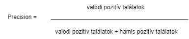
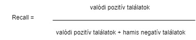
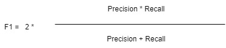

# Osztályozás és felügyelt tanulás {#felugyelt}

## Fogalmi alapok {#basics}

```{r, include=FALSE}
source("_common.R")

```

A mesterséges intelligencia két fontos társadalomtudományi alkalmazási területe a felügyelet nélküli és a felügyelt tanulás. Míg az első esetben -- ahogy azt a *[Felügyelet nélküli tanulás](#lda_ch)* fejezetben bemutattuk -- az emberi beavatkozás néhány kulcsparaméter megadására (így pl. a kívánt topikok számának meghatározására) szorítkozik, addig a felügyelt tanulás esetében a kutatónak nagyobb mozgástere van "tanítani" a gépet. Ennyiben a felügyelt tanulás alkalmasabb hipotézisek tesztelésére, mint az adatok rejtett mintázatait felfedező felügyelet nélküli tanulás. 

A felügyelt tanulási feladat megoldása egy úgynevezett tanító halmaz (*training set*) meghatározásával kezdődik, melynek során a kutatók saját maguk végzik el kézzel azt a feladatot melyet a továbbiakban gépi közreműködéssel szeretnének nagyobb nagyságrendben, de egyben érvényesen (*validity*) és megbízhatóan (*reliability*) kivitelezni. Eredményeinket az ugyanúgy eredetileg kézzel lekódolt, de a modell-építés során félretett teszthalmazunkon (*test set*) értékelhetjük. Ennek során négy kategóriába rendezzük modellünk előrejelzéseit. Egy, a politikusi beszédeket a pozitív hangulatuk alapján osztályozó példát véve ezek a következők: azok a beszédek amelyeket a modell helyesen sorolt be pozitívba (valódi pozitív), vagy negatívba (valódi negatív), illetve azok, amelyek hibásan szerepelnek a pozitív (hamis-pozitív), vagy a negatív kategóriában (hamis-negatív). Mindezek együttesen egy ún. tévesztési táblát (*confusion matrix*) adnak, melynek további elemzésével ítéletet alkothatunk modellépítésünk eredményességéről.

A felügyelt tanulás számos kutatási feladat megoldására alkalmazhatjuk, melyek közül a leggyakoribbak a különböző osztályozási (*classification*) feladatok. Miközben ezek – így pl. a véleményelemzés – szótáralapú módszertannal is megoldhatóak (lásd a *[Szótárak és érzelemelemzés](#sentiment)* fejezetet), a felügyelt tanulás a nagyobb előkészítési igényt rendszerint jobb eredményekkel és rugalmasabb felhasználhatósággal hálálja meg (gondoljunk csak a szótárak domain-függőségére). A felügyelt tanulás egyben a mesterséges intelligencia kutatásának gyorsan fejlődő területe, mely az e fejezetben tárgyalt algoritmus-központú gépi tanuláson túl az ún. mélytanulás (*deep learning*) és a neurális hálók területén is zajlik egyre látványosabb sikerekkel.

Az egyes modellek pontosságának kiértékelésére általában az F értéket használjuk. Az F érték két másik mérőszám keresztezésével jön létre a *precision* és a *recall*, előbbi a helyes találatok száma az összes találat között. Az utóbbi pedig a megtalált helyes értékek aránya.





Ebből a két mérőszámból áll az *F* érték vagy *F1*, amely a két mérőszám harmonikus átlaga.



Jelen fejezetben két modell fajtát mutatunk be egyazon korpuszon az Support Vector Machine (SVM) és a Naïve Bayes (NB). Mindkettő a fentiekben leírt klasszifikációs feladatot végzi el, viszont eltérő módon működnek. Az SVM a tanító halmazunk dokumentumait vektorként reprezentálja, ami annyit jelent, hogy hozzájuk rendel egy számsort, amely egy közös térben betöltött pozíciójukat reprezentálja.


Ezt követően pedig a különféle képpen képpen felcímkézett dokumentumok között egy vonalat (hyperplane) húz meg, amely a lehető legnagyobb távolságra van minden egyes dokumentumtól.


Innentől kezdve pedig a modellnek nincs más dolga, mint a tanító halmazon kívül eső dokumentumok vektor értékeit is megállapítani, elhelyezni őket ebben a közös térben, és attól függően, hogy a hyperplane mely oldalára kerülnek besorolni őket. Ezzel szemben az NB a felcímkézett tanító halmazunk szavaihoz egy valószínűségi értéket rendel annak függvényében, hogy az adott szó adott kategóriába tartozó dokumentumokban hányszor jelenik meg, az adott kategória dokumentumainak teljes szószámához képest. Miután a teszt halmazunk dokumentumaiban minden szóhoz hozzárendeltük ezeket a valószínűségi értékeket nincs más dolgunk, mint a teszt halmazunkon kívül eső dokumentumokban felkeresni ugyanezen szavakat, a hozzájuk rendelt valószínűségi értékeket aggregálni és ez alapján minden dokumentumhoz tudunk rendelni több valószínűségi értéket is, amelyek megadják, hogy mekkora eséllyel tartozik a dokumentum a teszt halmazunk egyes kategóriáiba.

## Osztályozás felügyelt tanulással

Az alábbi fejezetben a CAP magyar média gyűjteményéből a napilap címlapokat tartalmazó modult használjuk.[^sml-1] Az induló adatbázis 71875 cikk szövegét és metaadatait (összesen öt változót: sorszám, fájlnév, a közpolitikai osztály kódja, szöveg, illetve a korpusz forrása -- *Magyar Nemzet* vagy *Népszabadság*) tartalmazza. Az a célunk, hogy az egyes cikkekhez kézzel, jó minőségben (két, egymástól függetlenül dolgozó kódoló által) kiosztott és egyeztetett közpolitikai kódokat -- ez a tanítóhalmaz -- arra használjuk, hogy meghatározzuk egy kiválasztott cikkcsoport hasonló kódjait. Az osztályozási feladathoz a CAP közpolitikai kódrendszerét használjuk, mely 21 közpolitikai kategóriát határoz meg az oktatástól az egészségügyön át a honvédelemig. [^sml-2]

[^sml-1]: A korpusz regisztációt követően elérhető az alábbi linken: <https://cap.tk.hu/a-media-es-a-kozvelemeny-napirendje>

[^sml-2]: A kódkönyv regisztrációt követően elérhető az alábbi linken: [https://cap.tk.hu/kozpolitikai-cap](https://cap.tk.hu/kozpolitikai-cap)

Annak érdekében, hogy egyértelműen értékelhessük a gépi tanulás hatékonyságát, a kiválasztott cikkcsoport (azaz a teszthalmaz) esetében is ismerjük a kézi kódolás eredményét („éles“ kutatási helyzetben, ismeretlen kódok esetében ugyanakkor ezt gyakran szintén csak egy kisebb mintán tudjuk kézzel validálni). További fontos lépés, hogy az észszerű futási idő érdekében a gyakorlat során a teljes adatbázisból -- és ezen belül is csak a Népszabadság részhalmazból -- fogunk venni egy 4500 darabos mintát. Ezen a mintán pedig a már korábban említett kétféle modellt fogjuk futtatni a NB-t és az SVM-t. Az ezekkel a módszerekkel létrehozott két modellünk hatékonyságát fogjuk összehasonlítani, valamint azt is megfogjuk nézni, hogy az eredmények megbízhatósága mennyiben közelíti meg a kézikódolási módszerre jellemző 80-90%-os pontosságot.

Először behívjuk a szükséges csomagokat.  Majd a felügyelet nélküli tanulással foglalkozó fejezethez hasonlóan itt is alkalmazzuk a `set.seed()` funkciót, mivel anélkül nem egyeznének az eredményeink teljes mértékben egy a kódunk egy késöbbi újrafuttatása esetén.

```{r include = TRUE}
library(stringr)
library(dplyr)
library(quanteda)
library(caret)
library(quanteda.textmodels)
library(HunMineR)

set.seed(1234)
```

Ezt követően betöltjük a ` HunMineR`-ből az adatainkat. Jelen esetben is vethetünk egy pillantást az objektum tartalmára a glimpse funkció segítségével, és láthatjuk, hogy az öt változónk a cikkek tényleges szövege, a sorok száma, a fájlok neve, az újság, ahol a cikk megjelent, valamint a cikk adott témába való besorolása, amely kézi kódolással került hozzárendelésre.

```{r include = TRUE}
Data_NOL_MNO <- HunMineR::data_nol_mno_clean
glimpse(Data_NOL_MNO)
```

Majd pár kisebb átalakítást hajtunk végre az adatainkon. Először is ehhez a modellhez most csak a Népszabadság cikkeket fogjuk alkalmazni a Magyar Nemzet cikkeit kiszedjük az adataink közül. Ezután leegyszerűsítjük a kódolást. Összesen 21 témakört lefed a cikkek kézi kódolása most viszont ezekből egy bináris változót készítünk, amelynek 1 lesz az értéke, ha a cikk makrogazdaságról szól, ha pedig bármilyne más témakörről, akkor 0 lesz az értéke. A két fajta cikkből összesen 10000 db-os mintat veszunk, amelyben a két típus egyenlő arányban van jelen. A modellek pedig az ide történő besorolálst próbálják majd megállapítani a cikkek szövege alapján vagyis, hogy makrogazdasági témáról szól-e az adott cikk, vagy valamilyen más témáról. Majd kiválasztjuk a táblából a két változó, amelyekre szükségünk lesz a cikkek szövegét `text` és a cikkekhez kézzel hozzárendelt témát `label` a többit pedig elvetjük.

```{r include = TRUE}
Data_NOL <- Data_NOL_MNO %>% 
  subset(corpus == "NOL" & is.na(text) == F) %>% 
  mutate(label = if_else(majortopic_code == 1, 1, 0)) %>% 
  group_by(label) %>% 
  sample_n(5000) %>% 
  ungroup() %>% 
  select(text, label)
``` 

Ezt követően egy korpusszá alakítjuk az objektumunkat.

```{r include = TRUE}
nol_corpus <- corpus(Data_NOL)
``` 

Majd létrehozunk egy új objektumot id_train néven amely 1 és 4500 között 3600 különböző a `sample()` funkció segítségével véletlenszerűen kiválogatott számot tartalmaz. Utána pedig a korpuszunkhoz hozzá adunk egy új id_numeric elnevezésű változót, amely csupán a megszámozza az egyes cikkeket. Ezeket a késöbbiekben arra fogjuk felhasználni, hogy kialakítsuk a tanító és teszt halmazokat

```{r include = TRUE}
id_train <- sample(1:10000, 2500, replace = FALSE)
nol_corpus$id_numeric <- 1:ndoc(nol_corpus)
``` 

Ezt követően a korpuszunkat egy tokenekké alakítjuk és ezzel egyidejűleg eltávolítjuk a HunMiner beépített magyar stopszó szótárát, valamint szótövesítést is végrehajtunk. 

```{r include = TRUE}
stopszavak <- HunMineR::data_stopwords_extra

nol_toks <- tokens(nol_corpus, remove_punct = TRUE, remove_number = TRUE) %>% 
  tokens_remove(pattern = stopszavak) %>% 
  tokens_wordstem()
``` 

A tokeneket pedig egy dfm-é alakítjuk.

```{r include = TRUE}
nol_dfm <- dfm(nol_toks)
``` 

Ezt követően kialakítjunk a tanító és teszt halmazokat a korábban létrehozott változók segítségével. A lenti kód elsősora egy subsetet alakít ki az adattáblánk mindazon soraiból, amelyek id_numeric változója szerepel az id_train számsorban ez lesz a tanító alhalmaz. Majd ennek megfelelően egy másik alhalmazt alakítunk ki a teszteléshez, amely minden olyan sorát fogja tartalmazni adattáblánknak, amely id_numeric változója nem szerepel az id_train számsorban.

```{r include = TRUE}
train_dfm <- dfm_subset(nol_dfm, id_numeric %in% id_train)
test_dfm <- dfm_subset(nol_dfm, !id_numeric %in% id_train)
``` 

Azáltal pedig, hogy kialakítottuk a két alhalmazt el is végeztük az utolsó előkészítési folyamatot is, az így előkészített adatokon tudjuk majd futtatni a következőkben, mind az NB és az SVM modellünket.

### Naïve Bayes

A fejezet Naïve Bayesre vonatkozó kódjai quanteda tutoriál menetét és kódjait követik.[^quanteda_tutorial] Először létrehozzuk a modellünket, amely számára meghatározzuk, hogy a label változóhoz kell egy predikciót adnia, majd ezt alakalmazzuk az adatainkra. A `dfm_match` parancs segítségével eltávolítjuk a vizsgált dokumentumaink szavai közül mindazokat, amelyek nem szerepeltek a teszt halmazunkba. Erre azért van szükség, mivel az NB csak azokat a szavakat képes kezelni, amelyekhez már hozzárendelt egy valószínűségi értéket, tehát csak azokat, amelyek a teszt halmazban is megtalálhatóak.

[^quanteda_tutorial]: [https://tutorials.quanteda.io/machine-learning/nb/](https://tutorials.quanteda.io/machine-learning/nb/)

```{r include = TRUE}
nol_nb <- textmodel_nb(train_dfm, train_dfm$label)
dfm_kozos <- dfm_match(test_dfm, features = featnames(train_dfm))
``` 

A következő objektumban eltároljuk a kézikódolás eredményeit, amelyeket már ismerünk.

```{r include = TRUE}
tenyleges_osztaly <- dfm_kozos$label
``` 

Majd eltároljuk egy másik objektumban azokat az eredményeket, amelyeket a modellünk generált.

```{r include = TRUE}
becsult_osztaly <- predict(nol_nb, newdata = dfm_kozos)
``` 

A két fenti adat segítségével pedig létrehozhatjuk a korábban is említett tévesztési táblát.

```{r include = TRUE}
eredmeny_tabla <- table(tenyleges_osztaly, becsult_osztaly)
eredmeny_tabla
``` 

Ezt létrehozhatjuk a  `caret ` csomag funkciójával is, amely a tévesztési tábla mellett sok más hasznos adatot is megad a számunkra.

```{r include = TRUE}
confusionMatrix(eredmeny_tabla, mode = "everything")
``` 

Az eredményeken pedig láthatjuk, hogy még az egyszerűség kedvéért lecsökkentett méretű tanítási halmaz ellenére is egy kifejezett magas 83.25%-os pontossági értéket kapunk, amely többé-kevésbé megfeleltethető egy kizárólag kézikódolással végzett vizsgálat pontosságának. Ezt követően a kapott eredményeket a mérésünk minőségéről egy táblázatba rendezzük, későbbi összehasonlítás céljából.

```{r include = TRUE}
nb_eredmenyek <- data.frame(confusionMatrix(eredmeny_tabla, mode = "prec_recall")[4])
nb_eredmenyek$meres <- row.names(nb_eredmenyek)
nb_eredmenyek$modszer <- "Naïve Bayes"
row.names(nb_eredmenyek) <- 1:nrow(nb_eredmenyek)
``` 

### Support-vector machine

A következő kódsorral alkalmazzuk az SVM modellünket, hogy az adatainkon belül a label változóra vonatkozóan készítsen predikciót.

```{r include = TRUE}
nol_svm <- textmodel_svm(train_dfm, y = train_dfm$label)
``` 

Ismét eltároljuk a kézikódolás eredményeit, amelyeket már ismerünk. Valamint az eredményeket, amelyeket az SVM modellünk generált szintén eltároljuk egy objektumba.

```{r include = TRUE}
tenyleges_osztaly_svm <- dfm_kozos$label
becsult_osztaly_svm <- predict(nol_svm, newdata = dfm_kozos)
``` 

Ismét létrehozhatunk egy egyszerű tévesztési táblát. 

```{r include = TRUE}
eredmeny_tabla_svm <- table(tenyleges_osztaly_svm, becsult_osztaly_svm)
eredmeny_tabla_svm
``` 

Valamint jelen esetben is használhatjuk a `caret ` csomagban található funkciót, hogy még több információt nyerjünk ki a modellünk működéséről.

```{r include = TRUE}
confusionMatrix(eredmeny_tabla_svm, mode = "everything")
``` 

Itt ismét azt találjuk, hogy a csökkentett méretű korpusz ellenére is egy kifejezetten magas pontossági értéket 82.83%-ot kapunk. Az eredményeinket ismét egy adattáblába rendezzük, amelyet végül összekötünk az első táblánnkkal, hogy a két módszert a korábban tárgyalt három mérőszám alapján is összehasonlítsuk.

```{r include = TRUE}
svm_eredmenyek <- data.frame(confusionMatrix(eredmeny_tabla_svm, mode = "prec_recall")[4])
svm_eredmenyek$meres <- row.names(svm_eredmenyek)
svm_eredmenyek$modszer <- "Support-vector machine"
row.names(svm_eredmenyek) <- 1:nrow(svm_eredmenyek)

eredmenyek <- rbind(svm_eredmenyek, nb_eredmenyek) %>% 
  subset(meres %in% c("Precision", "Recall", "F1"))

names(eredmenyek)[1] <- "ertek"
``` 

Végül egy ábrával szemléltetjük a kapott eredményeinket, amelyen látható, hogy jelen esetben a két módszer közötti különbség minimális. Jelen esetben a Naïve Bayes jobban teljesített, mint a Support-vector machine az *F1* és *Precision* tekintetében, viszont utóbbi a *Recall* tekintetében.

```{r include = TRUE}
ggplot(eredmenyek, aes(x = modszer, y = ertek, fill = modszer)) +
  geom_bar(stat = "identity", width = 0.1) +
  facet_wrap(~meres, ncol=1)
``` 

