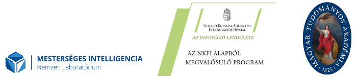

# Üdvözöljük! {-}


Könyvünk bevezeti az érdeklődőket a szövegbányászat és a mesterséges intelligencia társadalomtudományi alkalmazásának speciális problémáiba. Támaszkodva a Sebők Miklós által szerkesztett [*Kvantitatív szövegelemzés és szövegbányászat a politikatudományban*](https://poltextlab.tk.hu/uploads/files/Kvantitativ_szovegelemzes_keszpdf.pdf) (L’Harmattan, 2016) című kötet elméleti bevezetésére, ezúttal a társadalomtudományi elemzések során használható kvantitatív szövegelemzés legfontosabb gyakorlati feladatait vesszük sorra.

A szövegek adatként való értelmezése (text as data) és kvantitatív elemzése, avagy a szövegbányászat (text mining) a nemzetközi társadalomtudományi kutatások egyik leggyorsabban fejlődő irányzata. A szövegbányászat emellett a társadalomtudósok számára az egyik legnyilvánvalóbb belépési pont a mesterséges intelligenciát, ezen belül is gépi tanulást alkalmazó kutatások területére.

A magyar tankönyvpiacon elsőként ismertetünk lépésről-lépésre a nemzetközi társadalomtudományban használatos olyan kvantitatív szövegelemzési eljárásokat, mint a névelemfelismerés, a véleményelemzés, a topikmodellezés, illetve a szövegek felügyelt tanulásra épülő osztályozása. A módszereink bemutatására szolgáló elemzéseket az egyik leggyakrabban használt programnyelv, az R segítségével végeztük el. A kötet anyaga akár minimális programozási ismerettel is elsajátítható, így teljesen kezdők számára is ajánlott. A hazai olvasók érdeklődését szem előtt tartva példáink döntő többsége új, magyar nyelvű korpuszokra épül, melyek alapján megismerhetők a magyar nyelvű kvantitatív szövegelemzés módozatai.

A könyv megrendelhető a [Typotex kiadó honlapján!](https://www.typotex.hu/book/11810/sebok_szovegbanyaszat_es_mesterseges_intelligencia_r_ben)

## 3.0 - Online frissítések {-}

Az újítások teljes listája:

Első fejezet

* Frissítettük a felhasznált R csomagok listáját.
* Az Ady és Petőfi versekhez beraktunk egy példát a közös szavak kivonására.

Harmadik fejezet

* Pontosítottuk a példa linkjét.
* Pipe operátor definícióját bővítettük.

Ötödik fejezet

* A kódrészleteket több helyen fejlesztettük.
* dfm_ifidf() függvény definícióját bővítettük.
* textstat_lexdiv() függvény definícióját bővítettük.

Kilencedik fejezet

* A stopszavakat a HunMineR beépített szótárával használjuk fel a Quanteda helyett.

Tizenegyedik fejezet

* A fejezetet átdolgoztuk, több ponton bővítettünk leírásokat, kódrészleteket.

Tizenkettedik fejezet

* Javítottuk a használt mutatók terminológiáját, illetve feltüntettük a mutatók képleteit.
* A 12. fejezet végén összehasonlítjuk a Naïve Bayes és a Support-vector machine eredményeit.
* Több helyen javítottuk a leírásokat és a kódrészleteket.


Javasolt hivatkozás: 

Sebők Miklós, Ring Orsolya, és Máté Ákos. 2021. Szövegbányászat és Mesterséges Intelligencia R-ben. Budapest: *Typotex*.


Bib formátumban:

```
@book{sebokringmate2021szovegbanyaszat,
	address = {Budapest},
	title = {Szövegbányászat és mesterséges intelligencia {R}-ben},
	publisher = {Typotex},
	author = {Sebők, Miklós and Ring, Orsolya and Máté, Ákos},
	year = {2021}
}
```

<br>
<br>
 
*A kötet alapjául szolgáló kutatást, amelyet a Társadalomtudományi Kutatóközpont valósított meg, az Innovációs és Technológiai Minisztérium és a Nemzeti Kutatási, Fejlesztési és Innovációs Hivatal támogatta a Mesterséges Intelligencia Nemzeti Laboratórium keretében.*

*A kötet megjelenését az MTA Könyvkiadási Alapja, a Társadalomtudományi Kutatóközpont Könyvtámogatási Alapja, a Nemzeti Kutatási, Fejlesztési és Innovációs Hivatal (NKFIH FK 123907, NKFIH FK 129018), valamint az MTA Bolyai János Kutatási Ösztöndíja támogatta.*

```{r, echo=FALSE}

```

